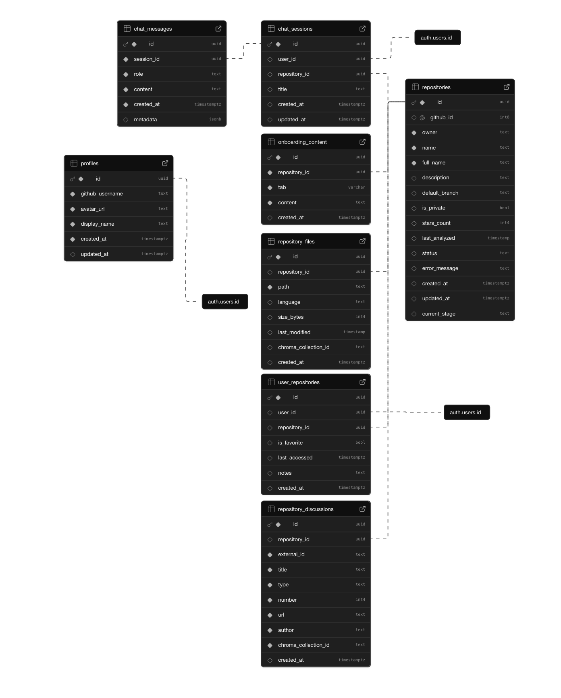

# CodeSherpa

### AI-Powered GitHub Repository Onboarding Assistant

CodeSherpa is a prototype tool, that should help developers quickly understand and navigate unfamiliar github codebases. By leveraging large language models and semantic search, it provides personalized guidance and answers questions about repository structure, code patterns, and development history.

### Features:

- Repository Analysis: Import GitHub repositories and analyze code, commits, issues, and documentation
- Onboarding Path Generation: Receive customized "getting started" recommendations and paths through the codebase
- AI Chat Interface: Ask natural language questions about the codebase and receive contextual answers

### Tech Stack:

- Frontend: Next.js 14, React, Tailwind CSS, shadcn/ui for some complex components
- Vector Search: ChromaDB for vector stores and semantic code search
- AI/LLM: OpenAI API for intelligent responses
- Embedding: Sentence Transformers for code embedding
- Authentication: Supabase Auth
- Bringing it together: Docker + Docker Compose

## Current Deployment

As of 02/04/2025 the project is hosted on [www.codesherpa.xyz](www.codesherpa.xyz), using two AWS EC2 instances. One is running the fullstack nextjs app, another is running the chromadb vector database. Instances are bound by a security group. Automatic GitHub workflow is setup to update the app on the server when changes are pushed to the main branch.

**Why AWS? ** The initial plan was to setup a standalone ChromaDB running in the cloud, and to deploy a nextjs app on Vercel/Netlify/AWS Amplify like a normal human being would do. This approach proved unfeasible due to the fact that our repository import is a lengthy process, impossible to perform stable in a serverless environment. The final deployment stack is: git/ssh to update the project, pm2 to keep a nextjs app running, nginx to handle HTTPS traffic, and a security group to limit access to the instances. Also, a nextjs app requiring user auth is an extra layer of security in front of otherwise exposed ChromaDB.

## Development

### Prerequisites

Locally the app runs seamlessly in a docker environment, the compose files are already setup to handle database persistence between starts. You will need the following things to get started:

- Docker and Docker Compose
- Supabase account (for authentication)
- OpenAI API key

### Installation

Clone the repository:

```shell
    git clone https://github.com/yourusername/code-sherpa.git
    cd code-sherpa
```

Create a .env file using the env.example (run `cp .env.example .env`), and add your API keys to the .env file:

```env
SUPABASE_URL=your_supabase_url_here
SUPABASE_ANON_KEY=your_supabase_anon_key_here
OPENAI_API_KEY=your_openai_api_key_here
CHROMA_DB_URL=http://chromadb:8000 // You can point this to an instance running in the cloud if you wish
CHROMA_RESULTS_NUMBER=5 // This is the number of search results returned to the AI chatbot
```

### Supabase Setup

In addition to connection strings, it is of course necessary to create tables and triggers in the Supabase database. Currently the app is using supabase for authentication and user management, as well as all the repository and processed files metadata.



Authentification requires getting a Github access token from the user, so we must also create an OAuth app in GitHub, and connect it to your Supabase auth provider.

Currently a trigger function is set up to add user data into profile table when a new user is signed in via GitHub OAuth.

### You Are Ready for Take Off

Start the application:

```shell
docker-compose up --build
```

Open your browser and navigate to http://localhost:3000

### Usage

**Import a Repository**: Enter a GitHub repository URL to import and analyze.
**Explore the Codebase**: Navigate through the repository structure and see key files.
**Ask Questions**: Use the AI chat interface to ask about any aspect of the code.
**Get Onboarding Guidance**: Receive personalized recommendations on where to start.

Some example questions:

- "How does authentication work in this app?"
- "What's the overall architecture of this project?"
- "Explain the component structure of the frontend"
- "Where should I start if I want to understand the data flow?"

## Important Technical Notes

**Node.js vs Bun**: While this project was originally developed with Bun, I've switched to Node.js due to compatibility issues between Bun and Next.js server actions in Docker environments. When using Bun, server actions would freeze without completing or returning errors, making authentication and other features unusable. Good old Node.js resolves this issue and provides better stability in the Docker environment.

**AWS deployment**: The project is currently deployed on AWS EC2 instances, using a combination of git/ssh to update the project, pm2 to keep a nextjs app running, nginx to handle HTTPS traffic, and a security group to limit access to the instances.

## Next Steps

- [ ] Setup a monitoring system to track the health of the application in the EC2
- [ ] Move away from Supabase to avoid vendor lock-in and overall getting charged in general
- [ ] Improve onboarding generation process with more intelligent tool use and enriched data mined from the repository
- [ ] Add a placeholder page to handle redeployment process without nginx showing an ugly 502
- [ ] Improve branch security, PR rules, document issues in GitHub to open project to contributions
- [ ] Add a LICENSE
